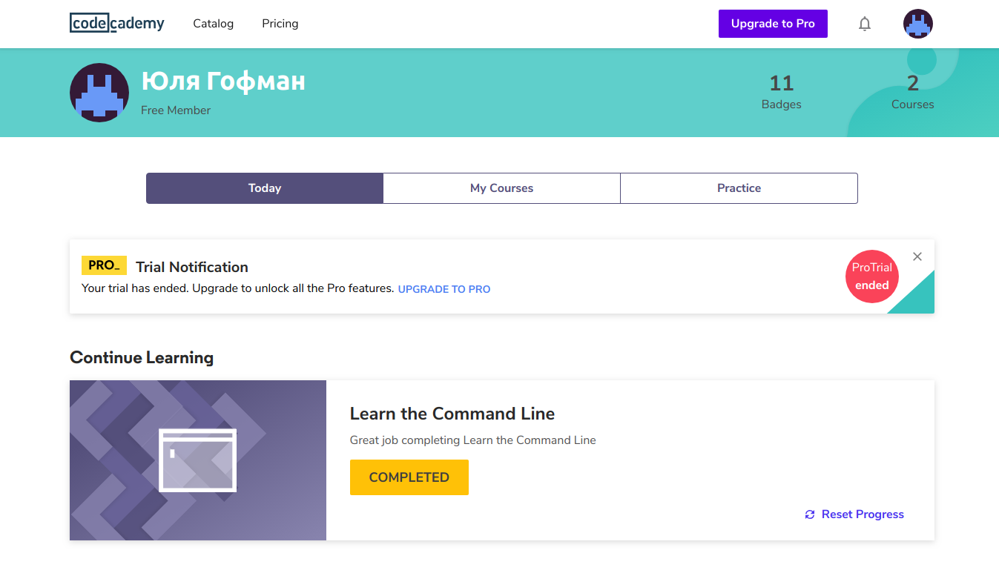
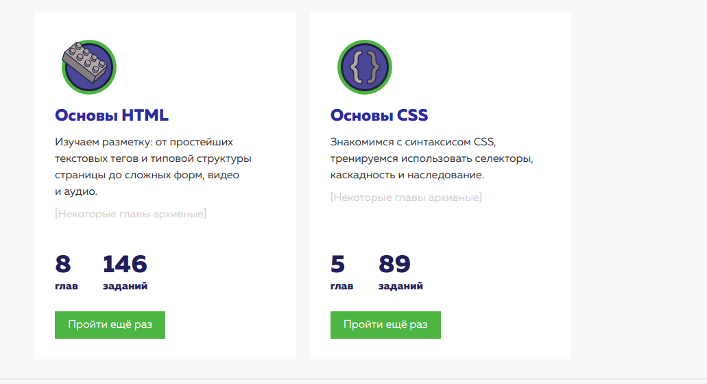
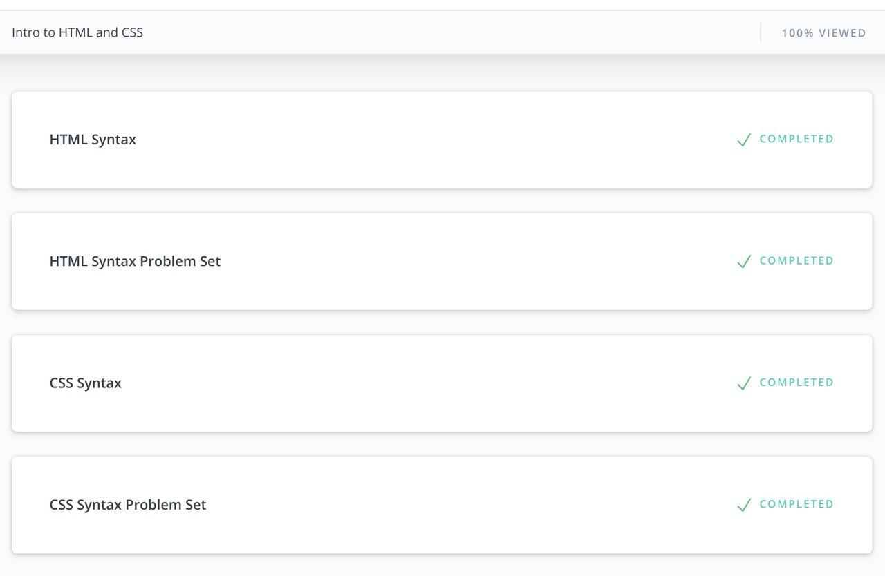
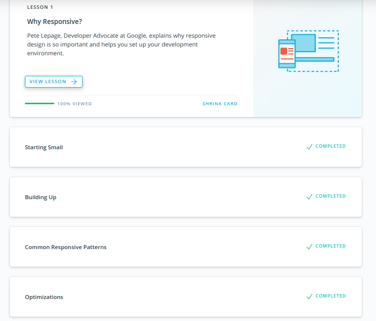
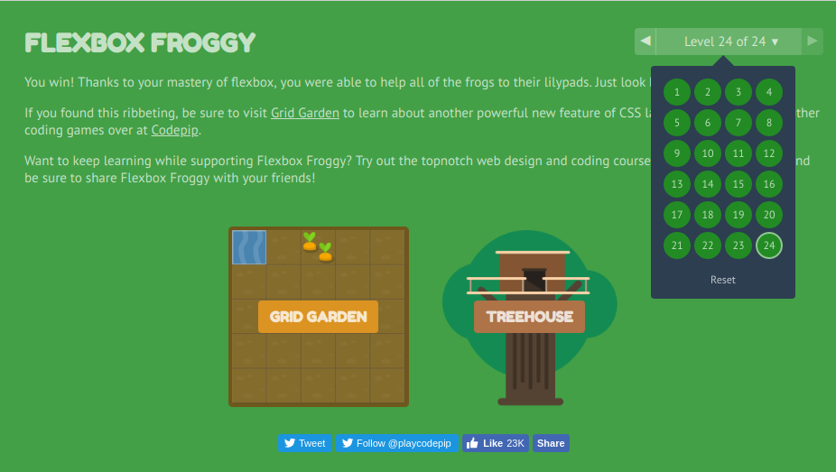

Great course, I've got maximum of satisfaction. Thank you so much!

## Linux CLI, and HTTP

I've got alot of new information. I hope it'll stay in my mind. Guess I'll get to know Python. And I've got know command line closer for sure! :)

## Intro to HTML and CSS

Great courses, I've got lot of new information and also motivation to move forward!

## Responsive Web Design

It was a brainstorm!